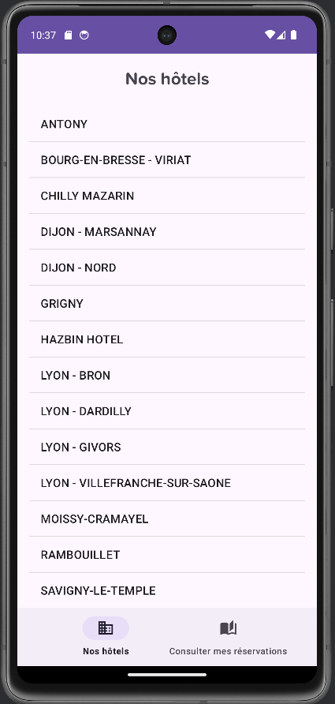
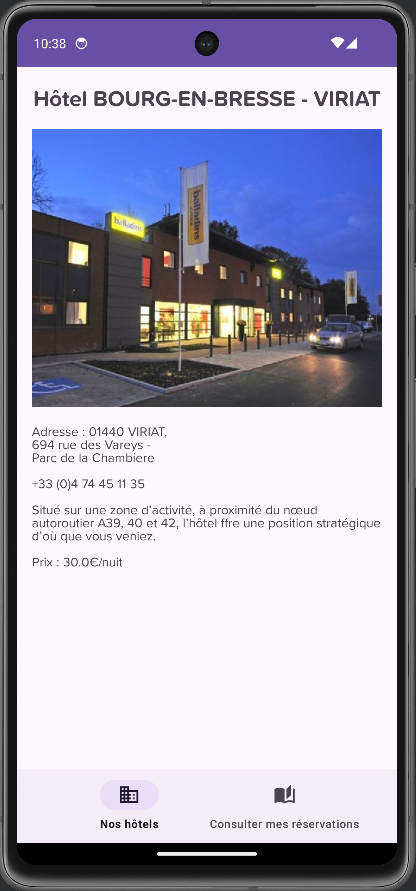
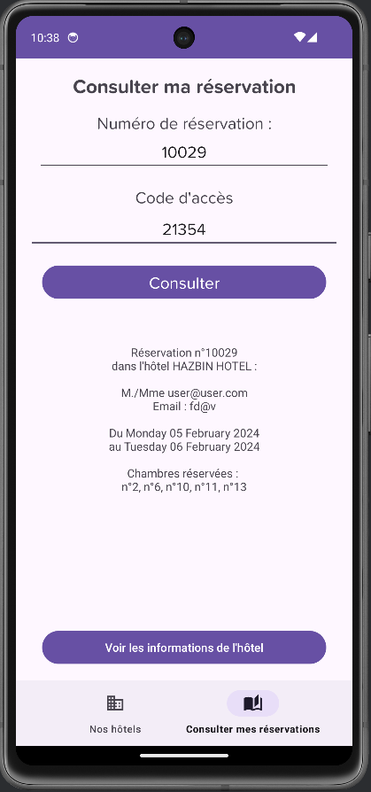

# Informations du projet

Ce projet **Android** a été réalisé en **java** avec un **webservice** avec **php** associé à une base de données SQL Server.

# Objectif de l'application

L'application Android a pour but de visionner les informations d'une base de données concernant des hôtels.

## Fonctionnalités

L'application permet de :
- Visualiser une liste d'hôtel.
- Voir les informations d'un hôtel sélectionné.
- Consulter une réservation via son numéro et son code d'accès.

## Schéma relationnel de la base de données exploitée

## Visuels de l'interface de l'application

### Page d'accueil (liste des hôtels) :

### Page de visualisation des informations d'un hôtel :

### Page de formulaire de création de réservation :

# Installation

## Comment joindre la base de données du projet ?

*Explication pour Microsoft SQL Server Management Studio*
--> Récupérez le fichier scriptBDD.sql de la base de données.
Dans MSSMS, faites "**Nouvelle requête**" -> *Collez le script* -> "**Exécuter**".

## Comment lier une base de données au projet ?

Dans le dossier "webservice" du projet, ouvrir le fichier "**DBModel.php**".
--> Cherchez les variables suivantes et complétez les avec vos propres valeurs :

	$server = "<nom_du_serveur_sql_server>";
	$dbname = "<nom_de_la_bdd>";
	$user = "<identifiant_de_connexion_a_la_bdd>";
	$password = "<mot_de_passe_de_connexion_a_la_bdd>";

Dans le dossier "app/src/main/res/xml/" du projet, ouvrir le fichier "**network_security_config.xml**".
--> Modifiez la ligne suivante avec l'addresse IP de votre serveur :

	<domain includeSubdomains="true">ip_adress_webservice</domain>
 
	Exemple :
	<domain includeSubdomains="true">192.168.1.1</domain>

 Dans le dossier "app/src/main/java/fr/vgtom/ap_hotel_android/" du projet, ouvrir le fichier "**varglobale.java**".
--> Modifiez les variables suivantes avec vos propres valeurs :

	private static String ipAdressWebservice = "ip_adress_webservice";     ex: "192.168.1.1"
	private static String pathWebService = "/.../.../";                    ex: "/webservice/hotel/"
